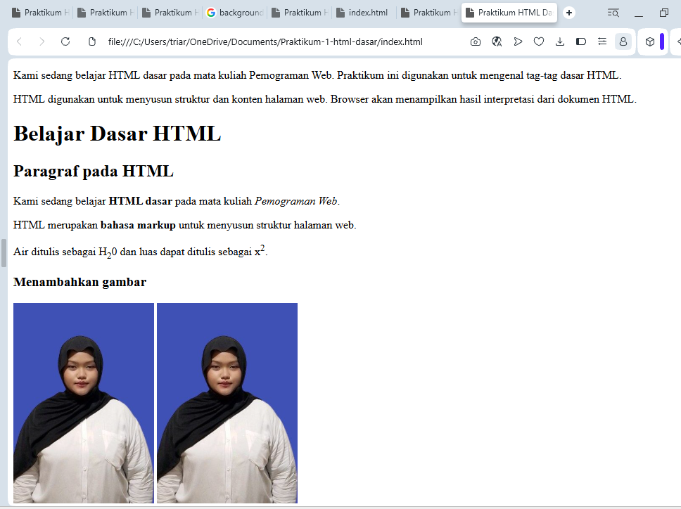

# Praktikum 1 - HTML Dasar

## Deskripsi

Praktikum ini mempelajari dasar-dasar HTML untuk membuat halaman web sederhana, mulai dari struktur HTML, heading, paragraf, format teks, gambar, hyperlink, list, hingga komentar.

## Tujuan

1. Memahami struktur dasar HTML.
2. Memahami penggunaan tag dan atribut HTML.
3. Membuat halaman web sederhana menggunakan HTML.

## Tools

* Visual Studio Code
* Web Browser
* GitHub

## Screenshot Hasil Praktikum

Screenshot hasil praktikum:



## Struktur Folder

```text
Lab1Web/
├── index.html
├── halaman2.html
├── images/
│   └── profil.jpg
└── README.md
```

## Langkah Praktikum

### 1. Struktur Dasar HTML

Membuat file `index.html` dengan struktur dasar:

```html
<!DOCTYPE html>
<html>
<head>
    <title>Halaman Web</title>
</head>
<body>

</body>
</html>
```

### 2. Heading dan Paragraf

Menggunakan tag heading `<h1>` sampai `<h6>` dan paragraf `<p>`.

```html
<h1>Judul Utama</h1>
<p>Ini adalah paragraf.</p>
```

### 3. Format Teks

Menggunakan beberapa tag format teks seperti `<b>`, `<strong>`, `<i>`, `<em>`, `<mark>`, `<small>`, `<del>`, `<ins>`, `<sub>`, dan `<sup>`.

### 4. Gambar

Menambahkan gambar menggunakan tag ``.

```html

```

### 5. Ukuran Gambar

Mengatur ukuran gambar menggunakan atribut `width` dan `height`.

```html

```

### 6. Hyperlink

Membuat link ke halaman lain dan website eksternal.

```html
<a href="halaman2.html">Halaman 2</a>
<a href="https://www.google.com">Google</a>
```

### 7. List

Membuat unordered list menggunakan `<ul>` dan ordered list menggunakan `<ol>`.

```html
<ul>
    <li>Informatika</li>
    <li>Sistem Informasi</li>
</ul>

<ol>
    <li>Belajar HTML</li>
    <li>Belajar CSS</li>
</ol>
```

### 8. Komentar

Membuat komentar pada kode HTML menggunakan:

```html
<!-- Ini adalah komentar -->
```

### 9. Menggabungkan Elemen

Menggabungkan seluruh elemen HTML menjadi sebuah halaman profil mahasiswa yang berisi heading, paragraf, gambar, hyperlink, list, dan komentar.

## Validasi

Kode HTML dapat divalidasi menggunakan **W3C Markup Validation Service**.

## Tugas

Repository dibuat dengan nama:

```text
Lab1Web
```

Setelah seluruh praktikum selesai, lakukan commit ke GitHub dan kumpulkan URL repository.

## Kesimpulan

Praktikum ini mempelajari dasar-dasar HTML dan penggunaannya untuk membuat halaman web sederhana.


10 Soal dan jawaban

1. Apa fungsi <!DOCTYPE html> pada dokumen HTML?
<!DOCTYPE html> berfungsi untuk memberi tahu browser bahwa dokumen menggunakan standar HTML.

2. Apa perbedaan tag, element, dan attribute dalam HTML?
Tag adalah penanda HTML, contohnya <p>.
Element adalah keseluruhan struktur dari tag pembuka, isi, dan tag penutup, contohnya <p>Hello</p>.
Attribute memberikan informasi tambahan pada element, contohnya href pada <a href="...">.

3. Apa perbedaan <p> dan <br>?
<p> digunakan untuk membuat paragraf, sedangkan <br> digunakan untuk membuat baris baru.

4. Apa fungsi atribut href pada tag <a>?
href digunakan untuk menentukan alamat atau tujuan hyperlink.

5. Apa perbedaan internal link dan external link?
Internal link mengarah ke halaman lain dalam website yang sama, contohnya halaman2.html.
External link mengarah ke website lain, contohnya https://www.google.com.

6. Apa fungsi atribut src dan alt pada tag ?
src digunakan untuk menentukan lokasi file gambar.
alt digunakan untuk memberikan teks alternatif jika gambar tidak dapat ditampilkan.

7. Apa perbedaan <ul> dan <ol>?
<ul> digunakan untuk membuat daftar tidak berurutan, sedangkan <ol> digunakan untuk membuat daftar berurutan/bernomor.

8. Apa yang terjadi jika path gambar pada atribut src salah?
Gambar tidak dapat ditampilkan karena browser tidak menemukan file pada lokasi yang ditentukan.

9. Mengapa penggunaan heading <h1> sampai <h6> harus terstruktur?
Agar struktur dan hierarki informasi pada halaman web menjadi jelas dan mudah dipahami.

10. Apa fungsi komentar dalam HTML?
Komentar digunakan untuk memberikan catatan atau penjelasan pada kode dan tidak ditampilkan pada halaman web.